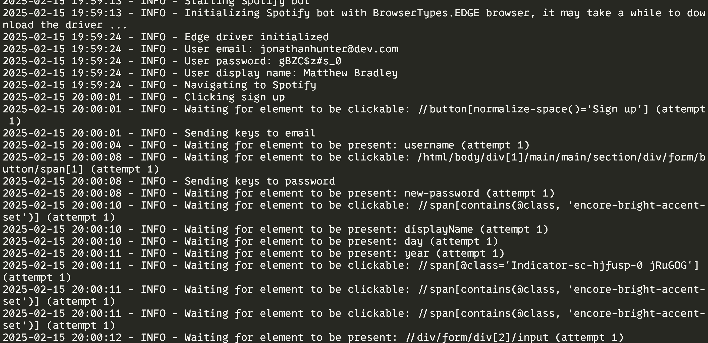

# Spotify Automation 
This code automates creating account in spotify and playing any song you want. It uses Selenium WebDriver to automate browser interactions with the Spotify web interface.

## Installation

> Before running the tests, ensure you have:
- Python 3.7 or higher installed on your system

Install the required Python packages by running:

```bash
pip install -r requirements.txt
```

## Usage

To run the tests, use the following command:

```bash
python main.py -b <browser> -s <song>
```

- `browser`: `firefox`, `edge`, `chrome`
- `song`: `song name`

### Example

```bash
python main.py -b chrome -s "Hello Adele"
```

## Screenshots

### Logs

.


## Recordings

.


