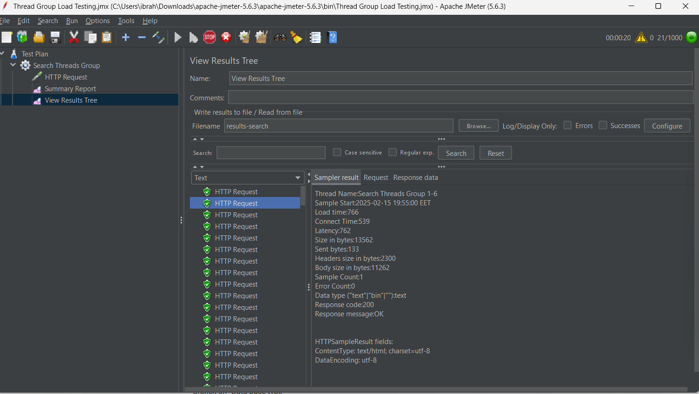
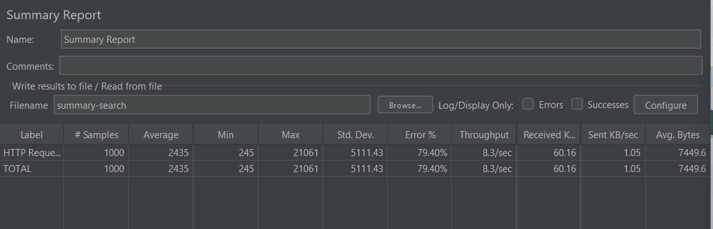

# Automation testing 
The automation testing suite is implemented in the `main.py` file. It uses Selenium WebDriver to automate browser interactions with the Spotify web interface.

## Installation

> Before running the tests, ensure you have:
- Python 3.7 or higher installed on your system

Install the required Python packages by running:

```bash
pip install -r requirements.txt
```

## Usage

To run the tests, use the following command:

```bash
python main.py -b <browser> -s <song>
```

- `browser`: `firefox`, `edge`, `chrome`
- `song`: `song name`

### Example

```bash
python main.py -b chrome -s "Hello Adele"
```

## Screenshots

### Logs

.


## Recordings

.


# Databases

You can find the query in the [sql file](./database-task/sql_queries.sql).

> Note: I named the first table as `customers` and the second table as `salesmen`.

```sql
SELECT c.cust_name, c.city AS customer_city, s.name AS salesman, s.city AS salesman_city, s.commission
FROM customers c
JOIN salesmen s ON c.salesman_id = s.salesman_id
WHERE c.city != s.city AND s.commission > 0.12;
```

# Performance Testing

Performance testing was done using `JMeter`.

You can find the report in the `performance-test` folder.

## Screenshots

### Results

.

### Summary

.


